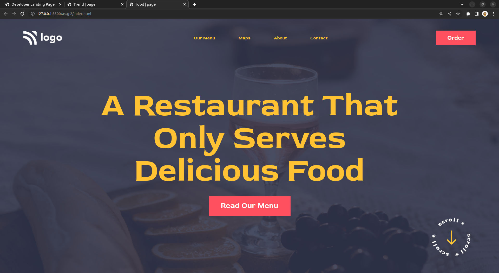

# Food | Page - HTML & CSS!

By Prince Kr Paswan

## [Link to the food-Page (project-2)](https://food-page.netlify.app/)

## What I learned While creating this page?

- Learnd to use css position [Relative & Absolute] property.

- I learned about z indexing to stack elements on top of each other.
- I learned how to add custom fonts.
- I learned how to make transparent background.

## This project took around 3.5 hours to complete.